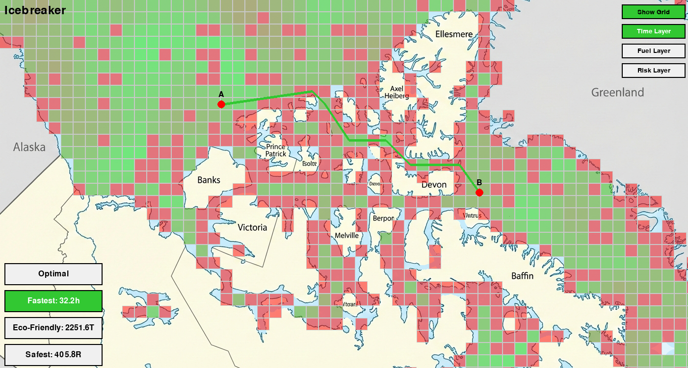
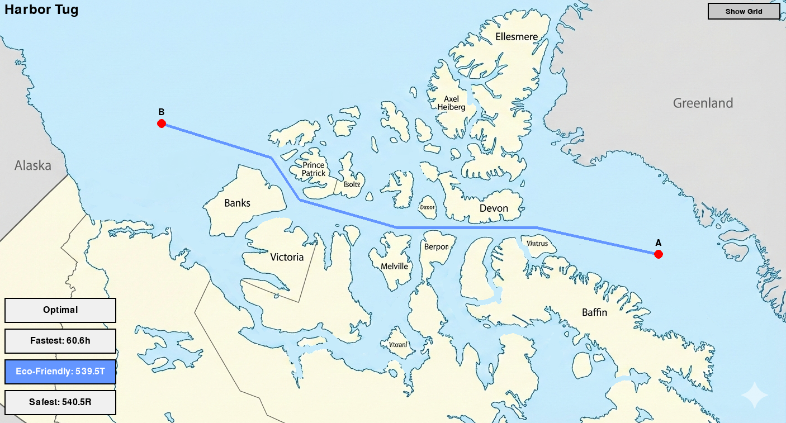

# Arctic Ship Routing Optimizer - uOttahack 8

<p align="center">
  
  
</p>
<p align="center">
  <sub>Left: <b>Fastest</b> route with the <b>time grid/layer</b> visible. Right: <b>Eco-Friendly</b> route.</sub>
</p>

## Project Overview
This project is an advanced ship routing and pathfinding tool designed for navigating the challenging conditions of the Arctic. It utilizes a **Pareto-optimal label-setting algorithm** to calculate multiple route options based on different optimization priorities: **Time**, **Fuel Consumption**, and **Safety (Risk)**.

Developed during **uOttahack 8**, this tool aims to provide maritime navigators with data-driven insights into the most efficient and safest paths through ice-prone waters.

## The Team
This project was developed by:
- **Arwa Khan**
- **Hasan Ahmed**
- **Shanzay Chaudhry**
- **Siddig Ahmed**

## Key Features
- **Multi-Objective Optimization**: Choose between "Fastest", "Eco-Friendly", and "Safest" routes.
- **Dynamic Environmental Analysis**: Analyzes satellite-style imagery to determine ice concentration and navigability.
- **Spatially Coherent Environmental Noise**: Uses Perlin noise to simulate realistic and varying weather/ice conditions.
- **Interactive Ship Selection**: Support for multiple ship types with unique attributes (speed, fuel consumption, durability) loaded directly from technical specifications.
- **Interactive Map Interface**: Set start and end points directly on the map and visualize the optimized routes with smooth animations.
- **Grid Visualization Layers**: Toggle between different data layers (Risk, Time, Fuel) to understand the underlying environmental costs.

## Technical Stack
- **Python**: Core logic and algorithm.
- **Pygame**: Graphical User Interface and map rendering.
- **Openpyxl**: Ship data management from Excel.
- **Noise**: Perlin noise generation for environmental simulation.
- **Custom Routing Engine**: Implementation of a Pareto-optimal label-setting algorithm for complex pathfinding.

## How to Run
1. Ensure you have Python installed.
2. Install the required dependencies:
   ```bash
   pip install pygame openpyxl noise
   ```
3. Run the main application:
   ```bash
   python main.py
   ```
